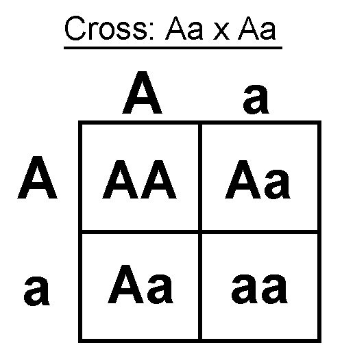
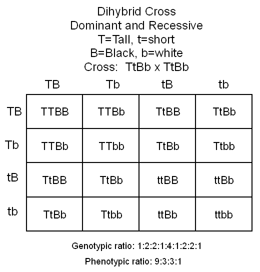

# Large Punnett Squares!

## Inspiration

Recently I took up a fascination with larger Punnett Squares (see the background section) and decided to write a module to do them for me.
In doing so I realized how me, am just a victim in a very large math game called genetics.
Each combination of genes is controlled by a probability and when given my human parents who have anywhere between 20,000 to 25,000 genes.
In practice there ends up being two to the power of twice the amount of genes that they possess, amount of options for my combination of genes.
Some options are mostly duplicates which is why I do not have freckles just like both of my parents.
But others are heterozygous genes meaning that my parents carried a recessive and dominant version of a gene but I ended up with the ressive version from both my parents.
Making it so that I would show a trait that neither of my parents do, like a dark haired child from two blonde parents.

In returning to code I wrote for this repository I wrote classes to represent genotypes and you can cross them by using the multiplier operator `*`.

## Examples
To use this just isntall the package from PyPI with pip.
```bash
pip install genotypes
```

Then you can import the module and use it.

```py

from genotypes import Genotype

mom = Genotype("AaBbRRgg")  # An example genotype

dad = Genotype("aaBBRrGg")  # Also an example genotype

chance = mom * dad

print(chance.probabilities())

```

## Background

When I was in middle school I learned about Punnett Squares in my 6th grade Life Science class.
We learned about Genotypes, Phenotypes, and Mendelian Genetics vs Modern Genetics.
A genotype is a list of genes, or rather allele pairs, that represent of biological genetic trait.
Such as `Bb` or `AaDD` or even `RrGGbb`.
Genes are usually either recessive or dominant (but not always).
Genotypes are used to model the combination of genes that influence a trait
Uppercase letters denote a dominate allele and lowercase letters denote a recessive allele.
Some genetic traits are controlled by only one gene like freckles or dimples.
Other traits like eye color are not controlled by one specific gene but rather multiple genes

But back to middle school.
One of units was about Punnett Squares.
We use them to model what the probailities are of different genetic traits when two individual mate.
In order to do this you setup a Punnett Square with each mates genotype and you cross them in each box.
Like so.



Some Punnett Squares are simple like that one, or get really large like this one.



# The Point
This module does the computation of these Punnett Squares for you and has helped further my understanding of Genetics.

